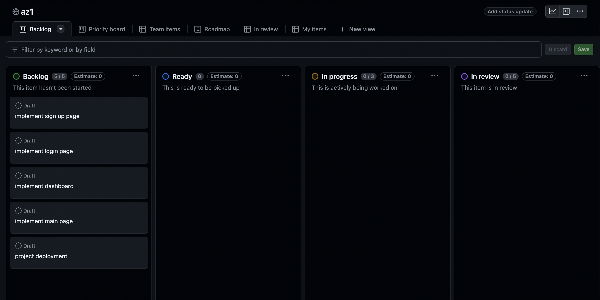
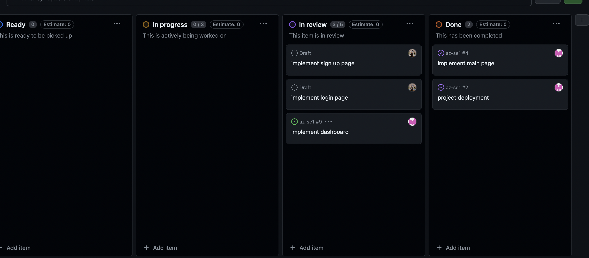
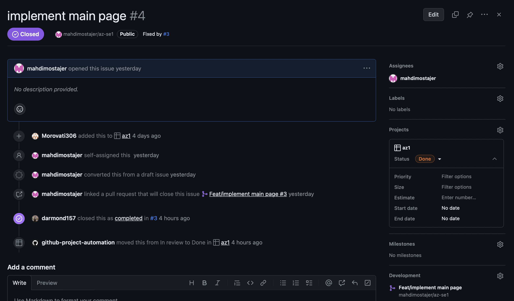
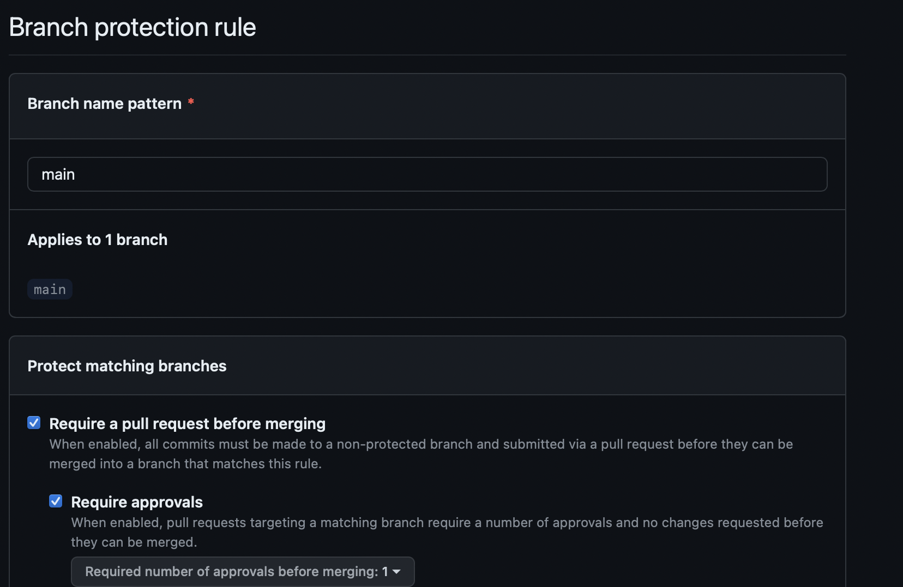
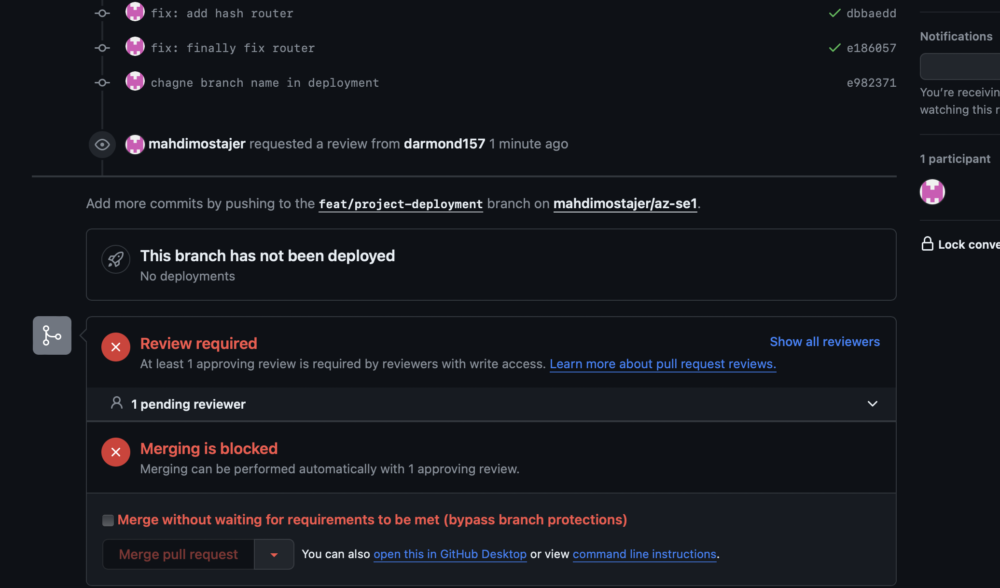
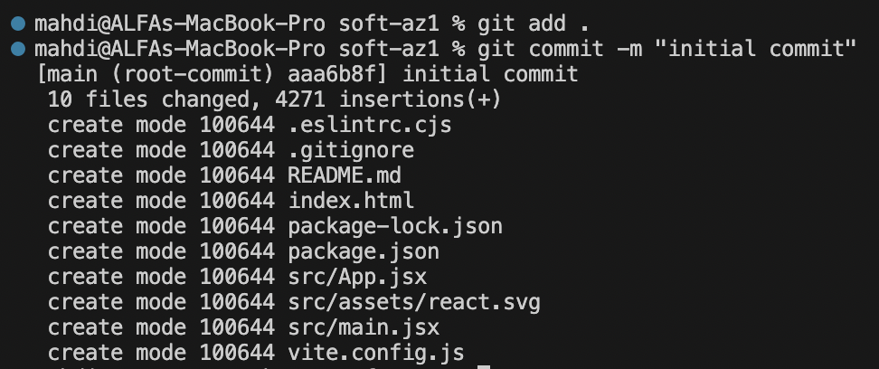
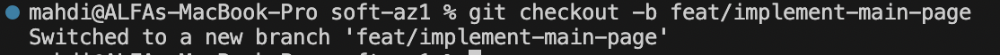
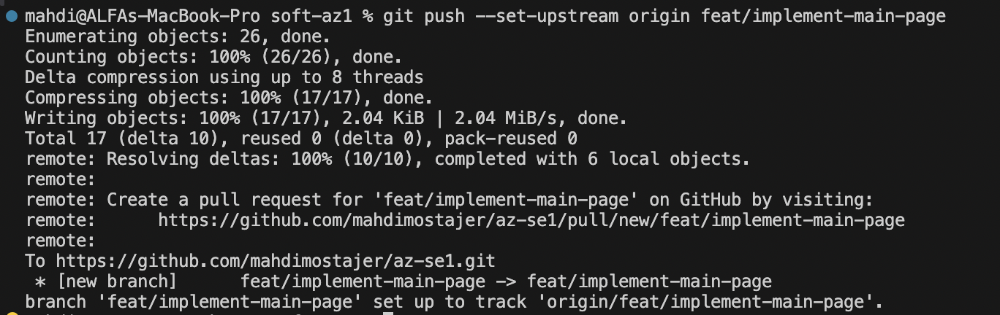
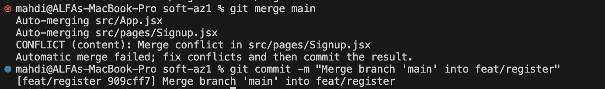
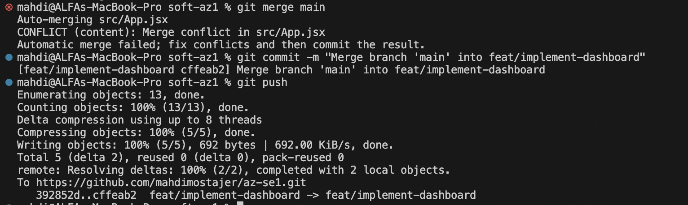

| اسم  | شماره دانشجویی |
| ------------- | ------------- |
| ابوالفضل مروتی  | 99102242  |
| بردیا رضایی | Content Cell  |
| مهدی مستاجران  | 98106048  |

<h1>گزارش آزمایش اول</h1>

<h2>توضیح پروژه</h2>
پروژه فرانت ما شامل چهار صفحه است: صفحه اصلی، صفحه لاگین، صفحه رجیستر و داشبورد. این صفحه‌ها استاتیک هستند و هیچ ریکوئستی ارسال یا دریافت نمی‌کنند اما به یکدیگر لینک شده اند و می‌توان بین آنها جابجا شد.
<h2>ایجاد بورد کانبان</h2>
در ابتدا تسک‌های پروژه شکسته شدند و هر تسک در بورد کانبان قرار گرفت: 

سپس اساین تسک‌ها به اعضا انجام شد و به مرور با انجام تسک‌ها بورد مربوطه آپدیت می‌شد:

همانطور که در تصویر مشخص است به ازای تسک ها یک issue باز میشد و از آن طریق مرج ریکوئست مربوطه به تسک لینک می‌شد.

<h2>
محافظت از برنچ main
</h2>
با ایجاد یک قاعده از برنچ main پروژه محافظت شده است به این صورت که تنها از طریق ارسال پول ریکوئست امکان مرج با این شاخه وجود دارد. همچنین هر پول ریکوئست باید حداقل توسط یک نفر ریویو شود.

بعد از ساخت هر پول ریکوئست پیام زیر نمایش داده می‌شود:

<h2>
استفاده از gitignore
</h2>
فایل gitignore در پروژه موجود است و موارد غیرضرور مانند node_modules از طریق این فایل از گیت حذف شده اند.

<h2>
نحوه commit زدن
</h2>

ایجاد کامیت با استفاده از ترمینال و مطابق شکل زیر انجام می‌شد. تعداد کامیت ها نیز از ۲۰ تا بیشتر است:

<h2>
نحوه ایجاد شاخه
</h2>

شاخه‌ها نیز با استفاده از دستور ترمینال  ایجاد شدند و نامگذاری آنها مطابق قواعد خواسته شده آزمایش است. تعداد شاخه‌ها از ۳ بیشتر است:

<h2>
برطرف کردن کانفلیکت‌ها
</h2>
در زمان پیاده سازی با حداقل ۳ conflict مواجه شدیم که مطابق زیر این conflict ها برطرف شدند. این کانفلیکت‌ها در زمان ادغام با شاخه main ایجاد شدند:

<h2>
سوالات
</h2>
1.	پوشه‌ی .git یک پوشه‌ی مخفی است که در داخل هر مخزن گیت (git repository) قرار دارد. این پوشه شامل تمام اطلاعات مربوط به تاریخچه‌ی نسخه‌ها و تغییرات، شاخه‌ها (branches)، تنظیمات و سایر اطلاعات مورد نیاز برای مدیریت نسخه است. هر تغییر و اقدامی که در گیت انجام می‌دهید، در این پوشه ذخیره می‌شود.
 
 
2.	Atomic commit به معنای انجام یک تغییر کامل و قابل بازگشت در یک commit است. به عبارت دیگر، commit atomic یعنی همه‌ی تغییرات مرتبط با یک عمل خاص در یک commit ذخیره می‌شوند. Atomic pull-request نیز به معنای ارسال یک درخواست pull-request که شامل یک تغییر atomic است است.
 
 
3.	دستور fetch برای دریافت تغییرات از remote repository به local repository استفاده می‌شود. این دستور فقط تغییرات را دریافت می‌کند و هیچ تغییری در شاخه‌ی کاری (working branch) اعمال نمی‌کند. 
دستور pull نیز تغییرات را از remote repository به local repository دریافت می‌کند، اما در عین حال آن‌ها را در شاخه‌ی کاری هم اعمال می‌کند.دستور merge برای ادغام دو شاخه (branch) با یکدیگر استفاده می‌شود.دستور rebase برای تغییر تاریخچه‌ی commit ها و انتقال آن‌ها به یک شاخه‌ی دیگر استفاده می‌شود.دستور cherry-pick برای انتخاب یک commit خاص از یک شاخه و اعمال آن در شاخه‌ی فعلی استفاده می‌شود.
 
 
4.	دستور reset برای بازگشت به یک commit قبلی و تغییر تاریخچه استفاده می‌شود.دستور revert برای اعمال تغییرات یک commit خاص به صورت برعکس استفاده می‌شود، به عبارت دیگر، تغییرات commit را لغو می‌کند.دستور restore برای بازگرداندن تغییرات یک فایل به حالت قبلی استفاده می‌شود.دستور switch برای تغییر شاخه‌ی کاری استفاده می‌شود.دستور checkout نیز برای تغییر شاخه‌ی کاری استفاده می‌شود، اما همچنین برای بازگشت به یک commit خاص یا بازگشت به وضعیت قبلی یک فایل نیز استفاده می‌شود.
 
 
5.	Stage یا index یک مفهوم در گیت است که به معنای آماده‌سازی تغییرات برای commit است. وقتی تغییراتی را در فایل‌های پروژه انجام می‌دهید، ابتدا باید آن تغییرات را در stage قرار دهید و سپس با دستور commit آن‌ها را ذخیره کنید.دستور stash برای ذخیره تغییرات در شاخه‌ی کاری به منظور بازگشت به حالت قبل از تغییرات مورد استفاده قرار می‌گیرد. با دستور stash تغییرات در شاخه‌ی کاری ذخیره می‌شوند و شاخه به حالت قبلی بازگردانده می‌شود.
 
 
6.	 Snapshot به معنای یک تصویر از وضعیت فعلی پروژه است. در گیت، هر commit یک snapshot از تمام فایل‌ها در آن زمان است. Commit یک عملیات است که snapshot از تغییرات اعمال شده را در گیت ذخیره می‌کند و تاریخچه‌ی نسخه را پیش می‌برد.
 
 
7.	Local repository یک مخزن گیت است که در داخل سیستم شما قرار دارد و شامل تاریخچه‌ی کامل پروژه و تغییرات اعمال شده است. Remote repository نیز یک مخزن گیت است که در سرور قرار دارد و به عنوان مرجع اصلی برای هماهنگ‌سازی و همکاری با سایر اعضای تیم استفاده می‌شود.

